# PowerEMS — User Manual

**Version:** 1.2.2
**App:** PowerEMS (Enterprise Energy Management System)
**Platforms:** Web (browser), Windows desktop, Android
**Audience:** End users (site engineers, plant managers, facility teams)
**Last updated:** 18 August 2026

---

## Table of Contents
1. [Introduction](#1-introduction)
2. [Getting Started](#2-getting-started)
3. [Dashboard](#3-dashboard)
4. [Reading Entry](#4-reading-entry)
5. [Meter Management](#5-meter-management)
6. [Analysis](#6-analysis)
7. [Reports](#7-reports)
8. [Excel Import](#8-excel-import)
9. [Alerts & Notifications](#9-alerts--notifications)
10. [Plan & Billing](#10-plan--billing)
11. [Settings](#11-settings)
12. [Backup & Data Safety](#12-backup--data-safety)
13. [Frequently Asked Questions](#13-frequently-asked-questions)
14. [Troubleshooting](#14-troubleshooting)
15. [Support](#15-support)

---

## 1. Introduction

PowerEMS is a cloud-connected energy management application that helps you:

- Record meter readings (manual or Excel bulk import)
- Track daily/monthly energy consumption (kWh), max demand (kVA), and power factor (PF)
- Compare actual usage against your **daily consumption target** and **contract demand**
- Detect **PF penalties**, **MD breach risks**, and **overspending** before the bill arrives
- Generate executive reports, monthly bill history, and savings opportunities
- Estimate your electricity bill every month using tariff rules

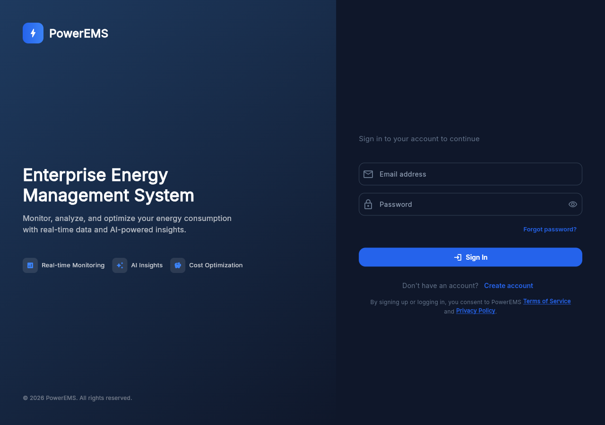

*Figure 01 — PowerEMS login page*

---

## 2. Getting Started

### 2.1 Access the app

| Platform | How to open |
|---|---|
| **Web** | Open the URL given by your service provider (e.g. `app.brilliants.in`) in Chrome/Edge/Firefox |
| **Windows** | Run `EMS.Setup.<version>.exe` installer |
| **Android** | Install the `app-release.apk` from your provider |

### 2.2 Create an account

1. Click **Create account / Sign up** on the login screen.
2. Enter your **email** and a **password** (minimum 8 characters, must include a letter and a number).
3. Accept the **Terms of Service** and **Privacy Policy** (consent is required by law).
4. A **verification email** is sent to you — click the link inside it.
5. Sign in with your email and password.

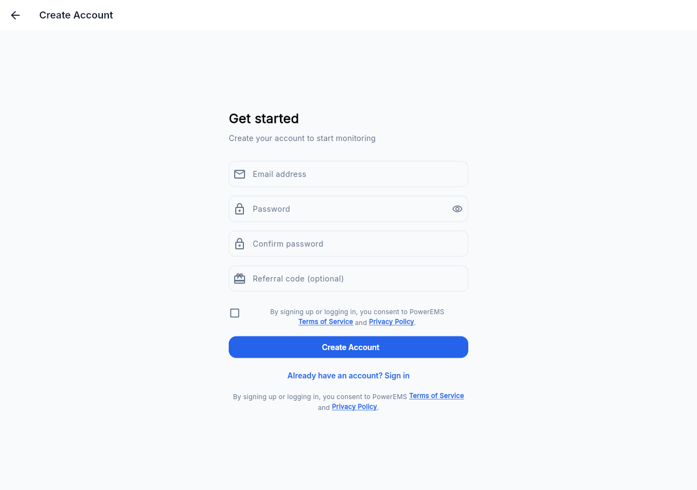

*Figure 02 — Registration / create account page*

### 2.3 Sign in / sign out

- Sign in with your registered email + password.
- **Forgot password?** Click *Reset Password* on the login page and follow the email link.
- Sign out from the sidebar bottom (user profile section).

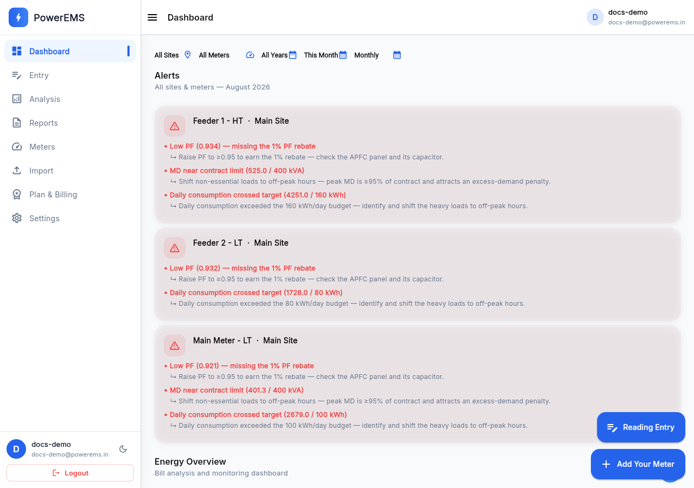

*Figure 03 — Main screen — sidebar + dashboard*

---

## 3. Dashboard

The Dashboard is your home screen. From the **left sidebar** you can jump to: Dashboard, Entry (reading entry), Analysis, Reports, Meters, Import, Plan & Billing, Settings.

### 3.1 Filters (Site / Meter / Month)

- **Site** and **Meter** dropdowns are above the Trends section — choose one meter or all meters.
- **Month/Year dropdown** controls which period the KPIs and charts show (This Month, a specific month, a year, or All Time).
- **Daily mode:** select a specific date to see that day's readings.

### 3.2 KPI cards

The top cards show the selected period:

- **Total Consumption (kWh)** — with change vs previous period
- **Estimated Bill (₹)** — estimated at today's usage rate; updates as readings are added
- **Power Factor** — with a green/yellow/red status
- **Billing Demand (kVA)** and **Load Factor (%)**

### 3.3 Trends section (charts)

- **Demand Trend (kVA):** monthly maximum demand line chart. A red dashed line shows **75% of contract demand** — stay below it to avoid demand charges rising.
- **Monthly Consumption:** monthly kWh line chart. A red dashed line shows **daily target × days of month** — any month above the line means you crossed the daily consumption budget.
- **Tap any point on a chart** to see the readings of that month/day (preview sheet with kWh, kVAh, MD, PF, Load Factor, MF, contract, billing MD, net bill).

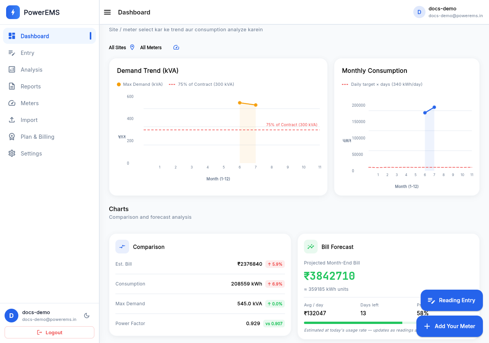

*Figure 04 — Trends charts with target lines*

### 3.4 Alerts panel

The dashboard shows alerts such as:

- **PF below 0.95** → rebate missed / surcharge risk
- **MD ≥ 95% of contract** → breach risk
- **Daily consumption crossed / near the daily target** (90% = near)

### 3.5 Quick actions (FAB)

- **Reading Entry** → jump to the entry form
- **Add Your Meter** → open the meter dialog

---

## 4. Reading Entry

1. Open **Entry** from the sidebar.
2. Select the **meter** from the dropdown.
3. Enter the meter display readings:

| Field | Meaning |
|---|---|
| **Meter display value (kWh)** | Current cumulative kWh reading shown on the meter |
| **Meter display value (kVAh)** | Current cumulative kVAh reading |
| **rkVARh Lag / Lead** | Reactive readings (if available) |
| **MD Recorded (kVA)** | Maximum demand recorded for the period |
| **Reading Date & Time** | Defaults to now |

4. The difference vs the previous reading is **calculated automatically** (shown in the blue box).
5. Click **Save**. After saving, if PF is below 0.95 or MD crossed 95% of contract, a notification alert fires.

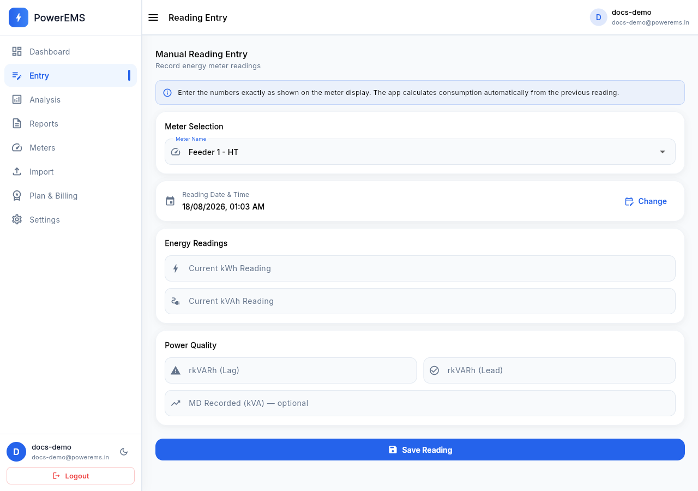

*Figure 05 — Reading Entry form*

**First reading of a meter:** since there is no previous reading, the entry is saved as the **baseline** with 0 units consumed (you confirm this in a warning dialog).

**Offline:** readings saved while offline are queued and **synced to the cloud automatically** when the connection returns (look for the sync notification).

---

## 5. Meter Management

Open **Meters** from the sidebar.

### 5.1 Add a meter

Click **+ / Add Your Meter** and fill:

| Field | Explanation |
|---|---|
| **Meter Name** | Unique name (e.g. `Unit-1 HT`) |
| **Site (factory/plant)** | Grouping label, e.g. `Pune Plant` |
| **Contract Demand (kVA)** | Sanctioned demand from your electricity bill |
| **CT Ratio** | e.g. `100/5 = 20` |
| **PT Ratio** | `1` if none |
| **Multiplying Factor (MF)** | Auto = CT × PT; all readings are multiplied by this |
| **Daily Avg Consumption Target (kWh/day)** | Your daily budget — draws the red dashed line on charts and fires target alerts |

### 5.2 Edit / delete

- **Edit** — pencil icon next to the meter. The name becomes **locked** once readings exist (renaming would break consumption tracking).
- **Delete** — removes the meter and its readings (confirm first).

### 5.3 Meter limits

Your plan includes a number of meters (default: 1). Extra meters are billed as a monthly add-on — see [Plan & Billing](#10-plan--billing).

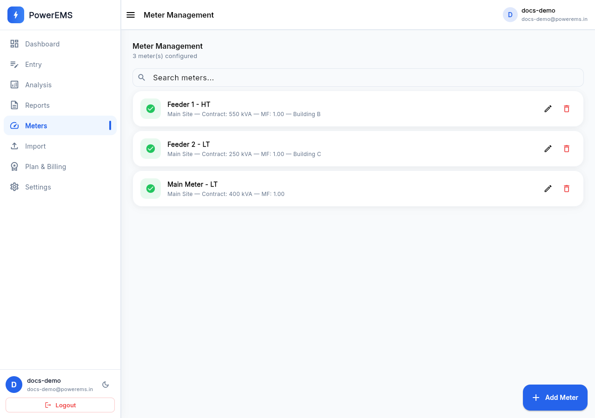

*Figure 06 — Meter Management list*
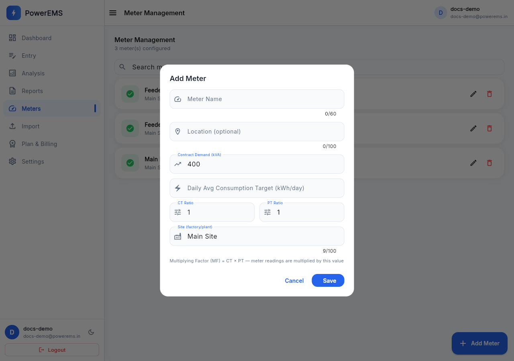

*Figure 07 — Add/Edit meter dialog*

---

## 6. Analysis

Open **Analysis** from the sidebar. Filter by meter/month as needed.

### 6.1 Insights
Automatic insights on bill health score, energy charges share, PF, load factor, demand utilization — with recommendations (e.g. capacitor bank sizing for PF improvement).

### 6.2 Trends (daily breakdown)
When a month (or "This Month") is selected, the **kWh Consumption** and **Max Demand** charts switch to a **daily breakdown**:

- Each point = one day of the selected month
- **Red dashed horizontal line = your daily target (kWh/day)** — any day above the line means that day crossed the budget
- Tap a point to preview that day's readings

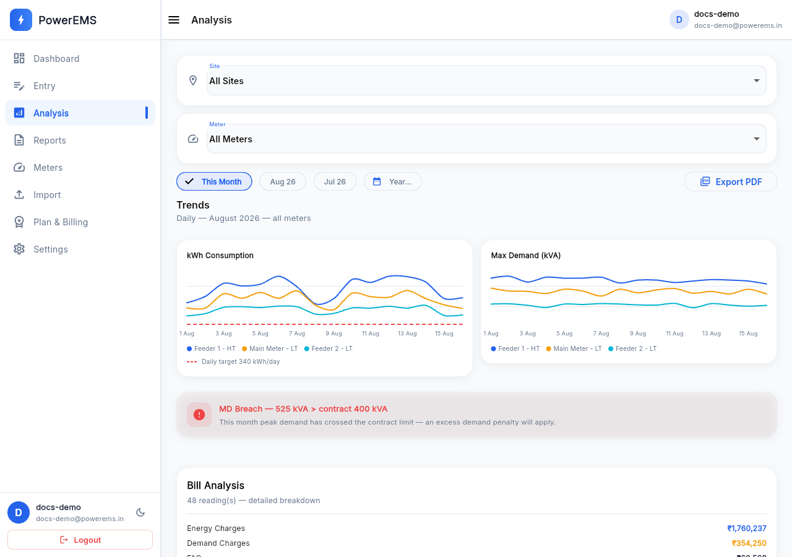

*Figure 08 — Analysis — daily kWh chart with dashed daily target line*

### 6.3 MD breach prediction
For the current month, PowerEMS computes the MD growth rate and predicts **when the demand will cross the breach threshold** (90% of contract) — including "no risk" confirmation.

### 6.4 Savings opportunities
Top 3 saving suggestions (demand reduction, PF improvement, contract demand optimizer) with estimated monthly savings (₹).

### 6.5 Reading list
All readings with edit/delete — correct a wrong reading any time (editing changes the derived consumption of the next reading automatically).

---

## 7. Reports

Open **Reports** from the sidebar. Filters (Site/Meter/Month) work the same as the dashboard.

### 7.1 Executive summary
Period totals: net bill, units, average unit cost, PF, billing demand, load factor.

### 7.2 Monthly bill history
Bar chart of the **last 12 months** — each bar shows the total bill (₹) on top; grey bars = months without data.

### 7.3 Bill accuracy (reconcile with actual bill)
1. Click **Record Actual Bill**.
2. Pick the month and enter the **actual bill amount** (and FAC rate if different).
3. PowerEMS shows the **difference vs its estimate** — green (within 10%) or red.
4. You can clear all recorded actual bills anytime.

### 7.4 Export
- **PDF** — printable report of the current view
- **Export CSV** — raw data of the filtered readings

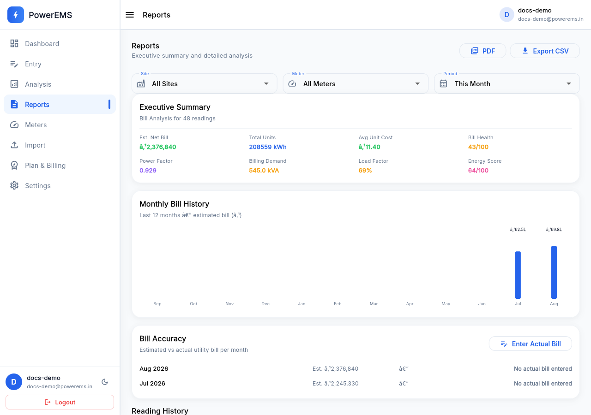

*Figure 09 — Reports — executive summary + monthly bill history*

---

## 8. Excel Import

Bulk import readings from Excel — see the **Import** item in the sidebar.

### 8.1 Get the sample format
1. Open **Import**.
2. Click **Excel Sample** — `ems_import_template.xlsx` downloads.
3. Fill your readings in **that exact format** (keep the columns the same).

### 8.2 Import steps
1. Click **Import Data** and select your `.xlsx` / `.xls` file(s).
2. **Confirm column mapping** — PowerEMS auto-detects columns; adjust if your file uses different names.
3. **Preview** — every row appears as an editable card (meter, date, kWh, kVAh, MD, PF, lag/lead). Fix values here.
4. Click **Import N Reading(s)** — nothing is saved before you confirm.

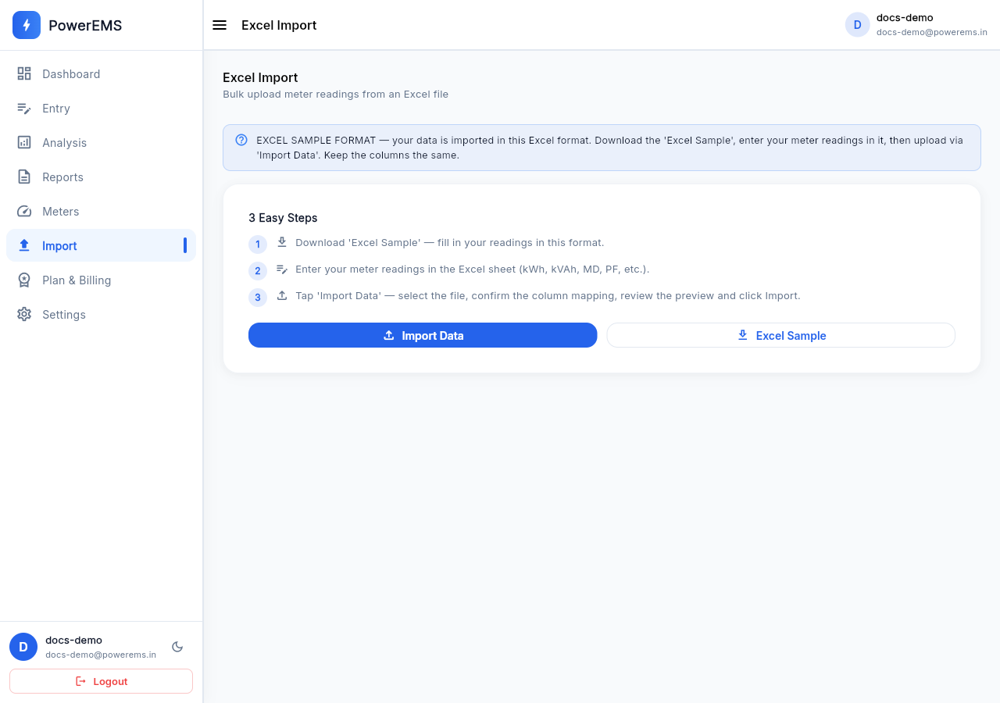

*Figure 10 — Excel Import page*
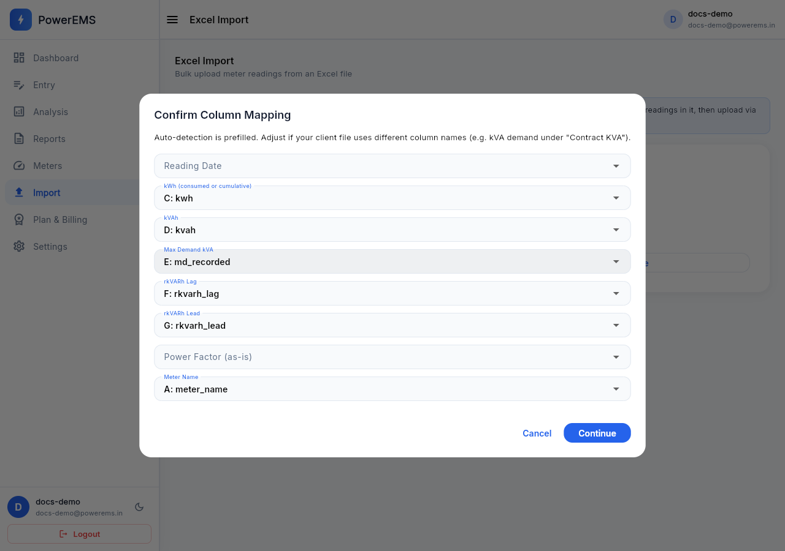

*Figure 11 — Confirm column mapping dialog*
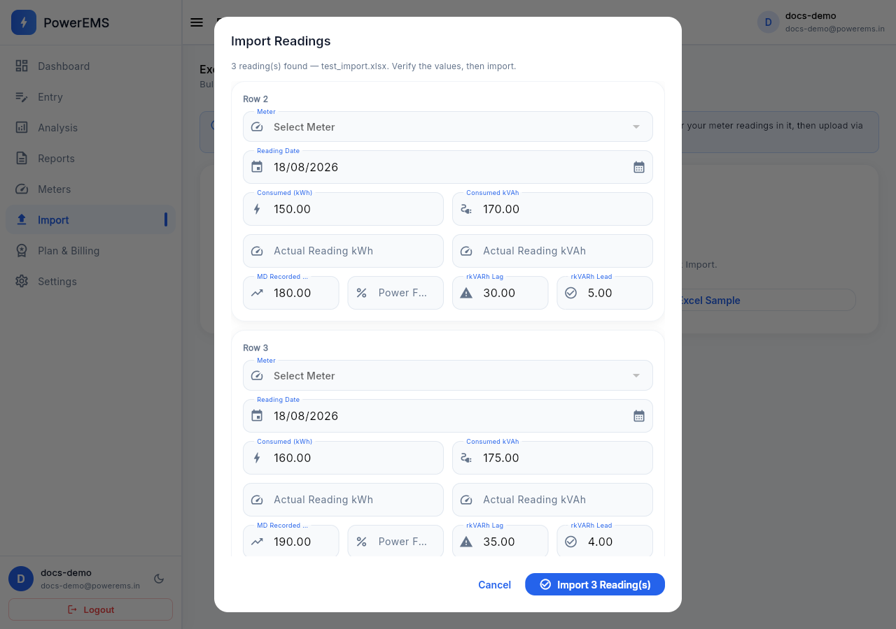

*Figure 12 — Import preview dialog*

---

## 9. Alerts & Notifications

PowerEMS raises alerts (in-app + system notifications on Windows):

| Alert | Trigger |
|---|---|
| **Low PF** | PF below 0.95 (rebate missed); below 0.90 (5% surcharge risk) |
| **MD breach risk** | MD at/above 95% of contract demand |
| **Daily target crossed** | Day consumption ≥ daily target |
| **Daily target near** | Day consumption ≥ 90% of daily target |
| **Reading reminder** | Month-end — "record today's reading" |
| **Sync complete** | Offline readings uploaded to cloud |

*Figure 13 — Dashboard alerts — MD risk, low PF, daily target crossed*

---

## 10. Plan & Billing

Open **Plan & Billing** from the sidebar.

- **60-day free trial** on sign-up (full access).
- **Base plan:** ₹799/month — includes **1 meter**.
- **Extra meters:** ₹99/month each, billed as a one-time top-up (base plan is NOT re-charged).
- **Payments:** Razorpay (UPI, cards, netbanking). After payment the plan activates automatically.
- **Owner access key:** if you have the owner key, redeem it from the Plan & Billing page for full access (used in trials/demo installs).
- When the plan ends, new readings and meter additions are locked until renewal.

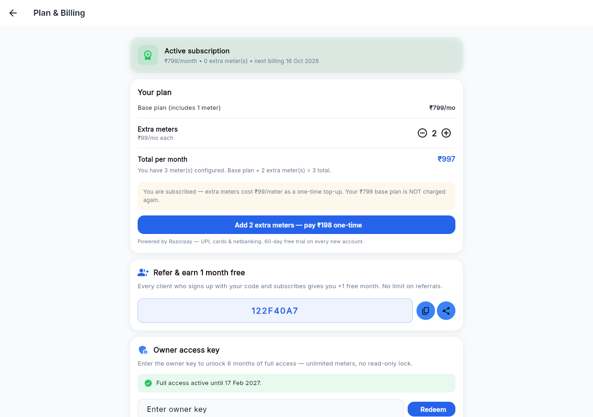

*Figure 14 — Plan & Billing page*

---

## 11. Settings

Open **Settings** from the sidebar.

### 11.1 Profile & theme
Your name/email (from the account) and dark/light theme toggle.

### 11.2 Tariff configuration
Used for all bill estimates. Two ways:

- **Category presets:** pick a category (MERC) + version → all rates fill automatically (energy rate, demand rate, FAC, wheeling, duty, etc.)
- **Advanced tariff:** individual fields — energy rate (₹/kWh), demand charge (₹/kVA), FAC, wheeling, electricity duty %, tax %, subsidy %, MD/contract demand (kVA), preceding 11-month demand window, rebates & adjustments (ICR rebate, LF incentive, PPD, bulk rebate, arrears), round bill to nearest ₹10, bill on kVAh toggle.

> ⚠️ Only adjust advanced tariff fields if you understand tariff mechanics — wrong rates give wrong estimates.

### 11.3 Backup & Restore
- **Export backup** — optionally encrypted with a passphrase (min length + letter + digit).
- **Restore from file** — replaces all current data with the backup (enter passphrase if encrypted).
- **Reset All Data** — permanently deletes everything locally AND from Supabase (this account). Irreversible — export a backup first.

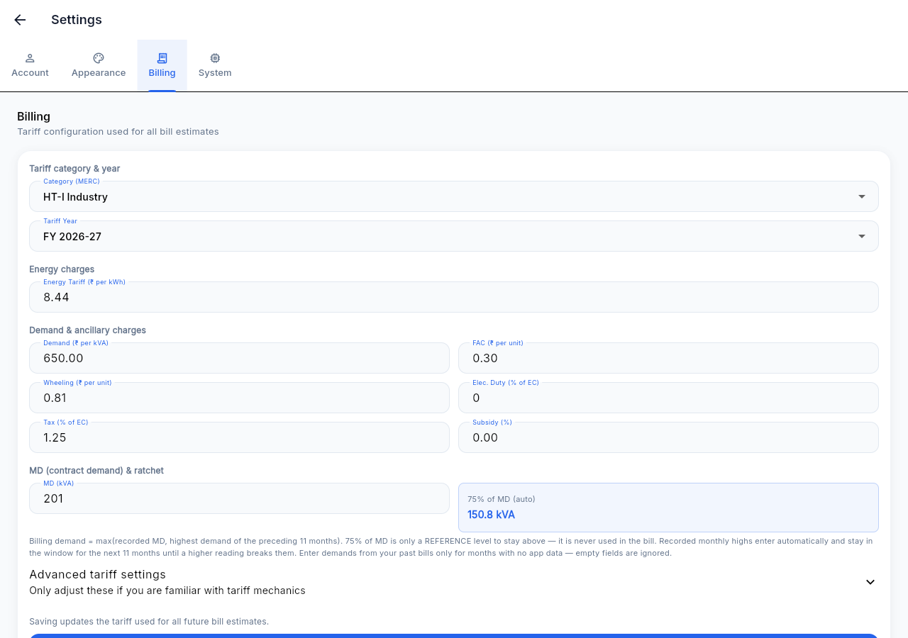

*Figure 15 — Settings — tariff section*
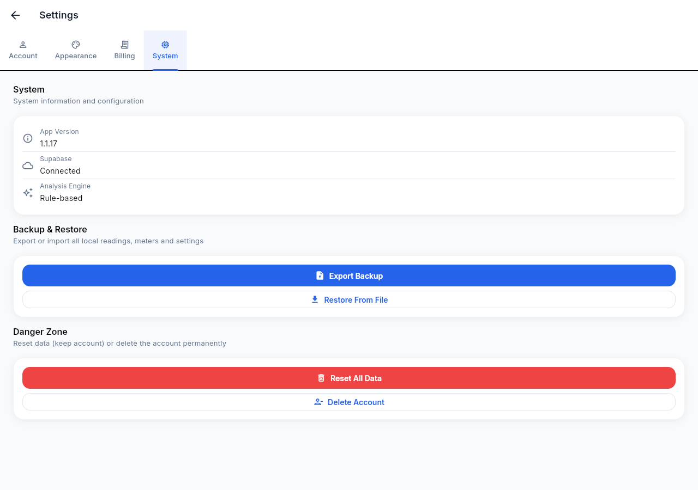

*Figure 16 — Settings — backup & restore*

---

## 12. Backup & Data Safety

- Data is stored **locally on the device** (works offline) and **synced to the cloud (Supabase)** under your account.
- Recommended practice: run the **Export backup** from Settings every month-end (keep the file in your own storage).
- Never share your account password or backup passphrase with anyone.
- Deleting the app without backup may lose local data — always export a backup first.

---

## 13. Frequently Asked Questions

**Q. Why is the estimated bill different from my actual bill?**
Estimates use configured tariff rates; the actual bill may include FAC changes, new surcharges, or meter-reading differences. Use *Record Actual Bill* in Reports to track the gap.

**Q. I set a daily target but the line is not visible on charts.**
The line appears only when a meter has a target saved. Edit the meter in *Meters* → *Daily Avg Consumption Target*. If it still does not appear after a reload, contact support (target may not have synced).

**Q. Can I add readings for yesterday or last month?**
Yes — change the Reading Date & Time in the entry form before saving.

**Q. Can I change a meter's name?**
Only if no readings exist yet. Once readings exist the name is locked to protect consumption tracking.

**Q. What happens when my plan expires?**
New readings and meter additions are locked; your existing data stays safe. Renew from *Plan & Billing*.

**Q. How are multiple meters billed together?**
All readings of the selected site/meter are summed and billed using the same tariff, including a shared demand ratchet window.

---

## 14. Troubleshooting

| Problem | Solution |
|---|---|
| **Blank screen on Import tab** | Update the app (fixed in v1.2.1). If persists, contact support. |
| **Login email not received** | Check spam/junk; use the Reset Password flow to re-verify. |
| **Readings not syncing** | Check internet; readings sync automatically on reconnect. If stuck, restart the app. |
| **Charts show "No data"** | Check Site/Meter/Month filters — data exists only for meters with readings in the selected period. |
| **PDF/CSV export fails** | Try again; on web, allow downloads in the browser. |
| **Payment page won't open** | Check internet; contact support with the error shown. |

---

## 15. Support

- **Application:** PowerEMS v1.2.x
- **Provider:** your service provider / system integrator
- **In-app:** check the notification alerts and Settings for account details
- Include in any support mail: your **email account**, the **screenshot** of the issue, and the **steps you performed**.

---

*End of User Manual — for administrator/operator configuration, see the separate **Operating Manual**.*
